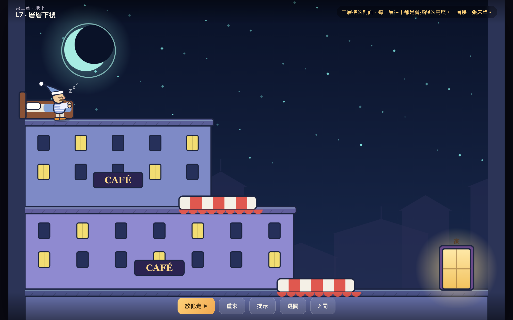

# 夢遊先生 · Mr. Sleepwalker

> 100 天 Vibe Coding 馬拉松 · **Day 1**
> 向 1999 年 Sarbakan 經典 Flash 解謎遊戲《Good Night Mr. Snoozleberg》（中文俗稱「夢遊先生」）致敬的重新詮釋作品。

夜深了，夢遊先生閉著眼睛從床上爬起，雙手前伸、慢吞吞又搖搖晃晃地走向屋頂。
你**不能直接控制他**——只能**移動屋頂上的物件**幫他鋪路：可以先擺好、也可以**邊走邊擺**，
但物件**一旦被他碰到就固定**，沒辦法拖一塊板子把他一路推到底。
別讓他摔太重而驚醒、別讓他踩到尖刺或掉進水裡，把他平安送回家。

畫面是手繪卡通的夜色城市屋頂（圓月光環、招牌、煙囪、暖黃窗），配上即時生成的慵懶 lounge jazz。



## 立即遊玩

直接用瀏覽器打開 `index.html` 就能玩，不需要任何安裝或伺服器。

```bash
open index.html        # macOS
```

## 玩法

- **擺道具**：滑鼠或手指拖動屋頂上的道具。可以先擺好，也可以**邊走邊擺**（看他往哪走，臨機應變）。
- **放他走 ▶**：先生開始夢遊。
- **重來**：把先生放回床上、重新佈置道具。
- **提示**：顯示物件該擺放位置的虛影。
- 鍵盤：`空白鍵` 放他走 / 下一關，`R` 重來，`H` 提示。

> 設計重點：物件**一旦被先生碰到就固定**，所以你不能「拖一塊板子當移動地板把他推到終點」——只能在他碰到之前擺對位置。每關發的道具配額剛好，**每個都非用不可、一個都不能省**（`test/solve.js` 會驗證）。

### 道具

| 道具 | 作用 |
|:--|:--|
| 木板 | 補地板缺口、搭橋 |
| 箱子 | 墊在落差中間當踏腳石；夠高時當牆讓他轉身 |
| 彈簧床 | 當跳板，把他往前上方彈飛，越過尖刺坑 |
| 床墊（雨棚）| 軟著陸，接住任何高度的墜落不受傷 |

另外場景裡會有**傳送門**（會發光的窗／下水道口）：走進去，會從連結的另一扇門冒出來——可以鑽下樓、繞過高牆、上到另一層，做出立體的進出路線。

### 失敗

摔落超過安全高度（會驚醒）、踩到尖刺、掉進水裡。失敗就重新佈置再試一次——本作刻意加了「每關獨立、隨時重來」，避開原作「一失誤整章重來」的勸退設計。

## 關卡

四個章節、共 **9 關**，是夜色城市屋頂的側視場景，引導夢遊先生從高處的家一路安全下到地面、再回到家。難度循序漸進、後段組合多道具與傳送門：

1. 半夜・起床（鋪木板過洞）
2. 下一層樓（床墊軟著陸）
3. 轉個彎（用箱子當牆讓他轉身）
4. 樓梯間（箱子墊落差 ＋ 木板過缺口）
5. 往上一層（彈簧床往上彈穿天花板的洞）
6. 通風管道（木板過缺口 → 鑽管道 → 床墊接住墜落）
7. 層層下樓（兩張床墊連下兩層）
8. 三段下樓（床墊 ＋ 木板 ＋ 箱子）
9. 回到地面（終章：床墊 ＋ 木板 ＋ 木板 ＋ 管道，最長的一段）

> 經過研究發現：原作其實**不是封閉房屋，而是露天屋頂/街景的側視全景**，它難的原因是「規則的不寬容」（不能控制角色、物件有時效、路線唯一、無存檔）。
> 本作**忠實復刻核心母題**（自動行走、不能直控、靠擺物件鋪路），並改用「**封閉房子剖面 + 道具配額**」這套對現代玩家更友善、但一樣燒腦的方式重新詮釋，不是逐關照搬原作。

## 技術

- 純前端、零依賴：HTML5 Canvas + 原生 JavaScript（無框架、無建置步驟、無外部圖檔，全部用 Canvas 向量繪製）。
- 物理引擎與繪圖、UI 分離：`js/engine.js` 是不碰 DOM 的純運算，因此可在 Node 直接跑自動化測試。

### 檔案結構

```
day-001-sleepwalker/
├── index.html
├── css/style.css
├── js/
│   ├── engine.js    # 物理引擎（純運算，Node 也能跑）
│   ├── levels.js    # 關卡資料（含每關解法座標）
│   ├── sprites.js   # Canvas 繪圖
│   ├── music.js     # WebAudio 即時生成的夜曲爵士背景樂
│   └── main.js      # 遊戲迴圈、輸入、UI、存檔、音效
└── test/
    ├── solve.js     # 驗證每關「可解 + 沒擺不能過 + 每個道具都不可省」
    └── robust.js    # 量測每關擺放容差（玩家容錯空間）
```

### 自動化測試

物理引擎是純運算，所以可在 Node 直接驗證——不用真的手動玩每一關：

```bash
node test/solve.js     # 每關：可解 + 沒擺不能過 + 每個道具都不可省 → 9/9 PASS
node test/robust.js    # 物件偏移多少還能過 → 每關最小容差 ≥ 14px
```

## 致敬與版權

原作《Good Night Mr. Snoozleberg》由加拿大工作室 **Sarbakan** 於 1999 年起製作。
本專案是基於對玩法機制的喜愛而做的**獨立重新詮釋**，所有程式碼與美術皆為原創、未使用任何原作素材，僅向經典致敬。
