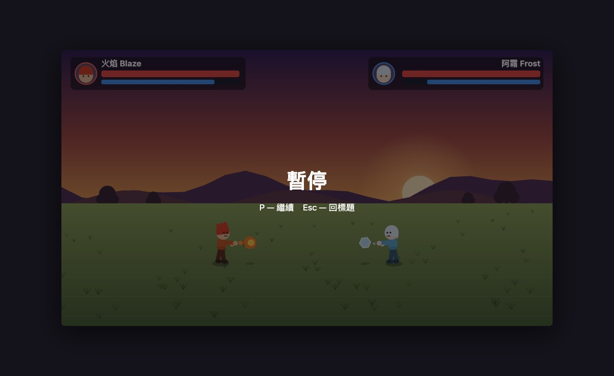
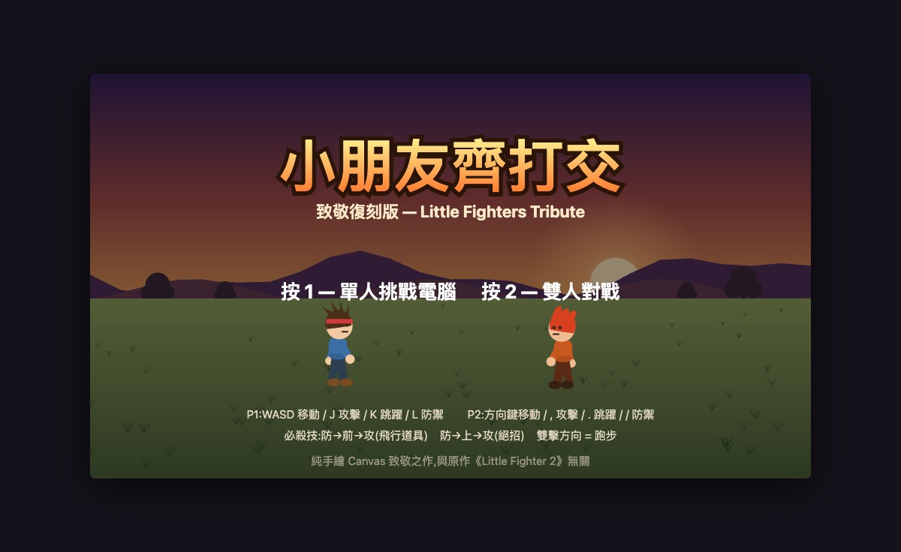
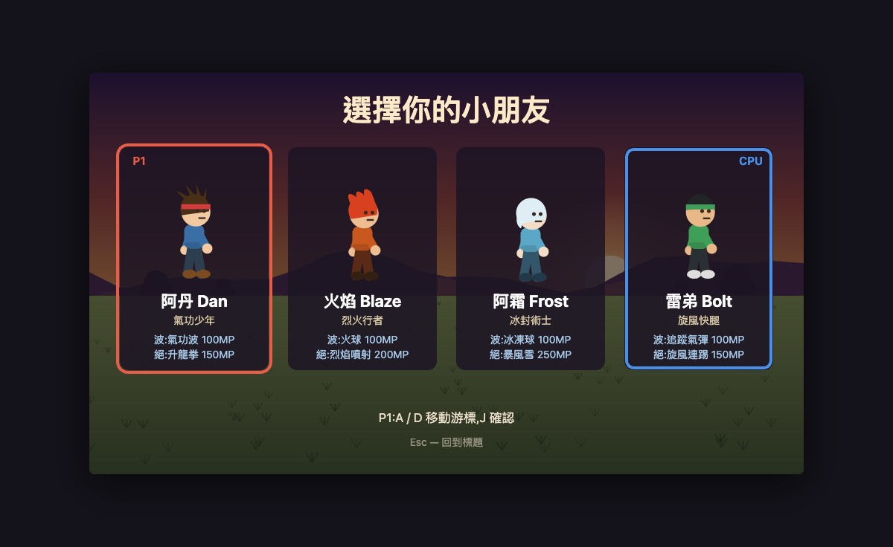
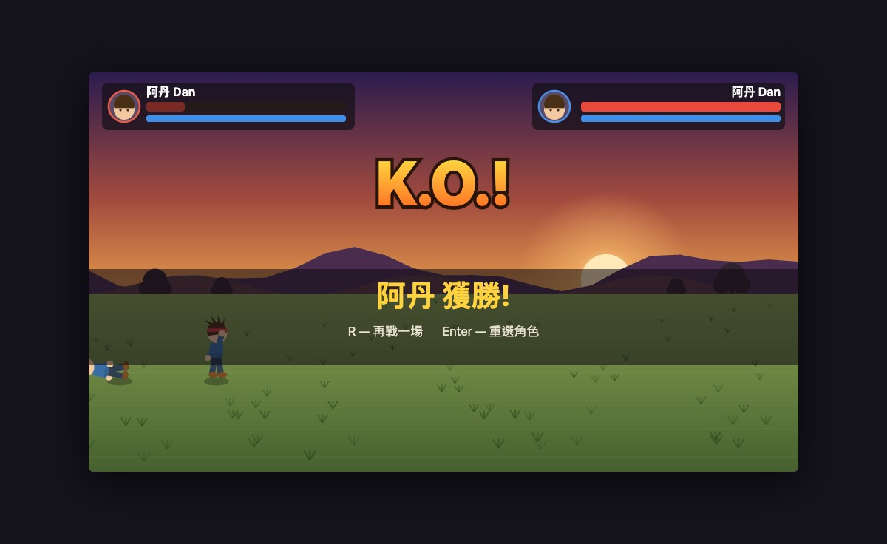

# Day 4 — 小朋友齊打交・致敬復刻版 Little Fighters Tribute

> 日期:2026-06-11　·　花費時間:約 2.5 小時　·　線上 demo:純本機 `open index.html`

## 一、這天做了什麼

復刻童年經典《小朋友齊打交》(Little Fighter 2)的核心玩法:2.5D 縱深格鬥、雙擊跑步、三連擊、防禦、搓招放波。4 隻原創致敬角色(阿丹/火焰/阿霜/雷弟),支援 1P 打電腦和 2P 同鍵盤對戰,macOS 瀏覽器直接開 `index.html` 就能玩。零依賴、零圖片素材,角色和場景全部 Canvas 向量手繪。

## 二、為什麼做這個

LF2 是台灣香港一代人的回憶,當年資訊課偷玩的就是它。它的手感有幾個很特別的設計——縱深沒對齊就打不到人、「防→前→攻」的搓招輸入、被打倒地的無敵時間——這些機制看起來簡單,自己動手做一次才知道每一條都是學問。另外也想延續 Day 1 夢遊先生的「致敬但不抄素材」路線:玩法復刻、美術原創,版權乾淨。

## 三、怎麼想的(思考過程 & 技術選擇)

- **引擎和畫面徹底分離**:`engine.js` 純邏輯零 DOM(座標、狀態機、命中判定、粒子都是純資料),`render.js` 只負責畫。好處是引擎可以直接丟進 Node 跑模擬測試,讓兩隻 AI 互打幾千幀自動驗證,不用人肉打 16 種角色組合。
- **座標系是 2.5D 的關鍵**:x 是水平、z 是縱深(同時就是畫面的 y 位置)、y 是離地高度,畫面位置 = `(x, z - y)`。攻擊命中要求 |Δz| < 22,這一條就是 LF2「站歪了打不到」的精髓。
- **搓招用輸入歷史佇列**:每個按鍵事件記下(鍵, 幀號),按攻擊時往回掃 48 幀內有沒有「防 → 方向」的序列。比狀態機式的指令輸入簡單,而且天然支援「按住防禦再搓」和「點放防禦再搓」兩種手感。
- **角色差異全部資料驅動**:4 隻角色共用同一套狀態機,個性放在 `data.js`(速度、波的種類、絕招種類)。火球會燒倒、冰球會凍住、追蹤彈會轉彎、升龍拳會浮空,都是參數組合。
- **放棄的東西**:LF2 的撿武器、群架模式、場景捲軸都砍了,先把 1v1 手感做對。音效用 WebAudio 即時合成(沿用 Day 1 經驗),不帶音檔。

## 四、踩了哪些坑、怎麼解的(本日精華)

| 遇到的問題 | 卡在哪 | 怎麼解決 | 學到什麼 |
|---|---|---|---|
| AI 互打 1200 幀只打中 3 下 | 兩隻 AI 站在 64px 距離瘋狂揮空,因為 AI 的出手距離(70)比拳頭實際範圍(54)遠,而接近邏輯又在 60 就停 | 寫了 `test/probe.js` 統計狀態分布才看出來;把出手距離對齊到拳頭範圍內 | 調 AI 別用猜的,先量化「它到底在幹嘛」;範圍類參數要從同一個來源讀,不要兩邊各寫一個數字 |
| 空中被打會永遠飄在半空 | 非擊倒攻擊把空中的人打進 `hurt`,而 `hurt` 結束直接回 `idle`——兩個狀態都沒有重力 | 規則改成「空中吃招一律擊落」(LF2 本來也是這樣) | 狀態機要逐狀態問「這個狀態管不管重力?」,漏一個就出現超現實畫面 |
| 搓招偶爾無效,查了很久 | 「放開防禦 + 按攻擊」落在同一幀時,防禦分支先把狀態切回 idle 就 `return`,攻擊鍵被吃掉 | 防禦狀態裡把攻擊判定移到「是否放開防禦」之前;補了回歸測試 | 同一幀多個輸入的處理順序是格鬥遊戲手感的隱形殺手 |
| 瀏覽器驗證一直「按了沒反應」 | 以為是輸入 bug,debug 半天發現是測試用的站樁 P1 早就被 CPU 打到 KO,遊戲結束後輸入本來就被凍結 | 改用 2P 模式做受控驗證(沒有 AI 干擾) | 自動化測試遊戲時,環境要先「靜止」;會動的 AI 是測試的噪音源 |
| Node vm 載入瀏覽器全域腳本 | `vm.runInContext` 裡的 `const` 不會掛到 context 物件上,外面拿不到 | 用 `vm.runInContext('CHAR_KEYS', ctx)` 把參照「念」出來 | vm 的全域 lexical scope 跟 context 物件是兩回事 |

## 五、成果怎麼看

- 怎麼跑:`open index.html`(macOS 任何瀏覽器,雙擊也行)
- 標題畫面按 `1` 單人挑戰電腦,按 `2` 雙人同鍵盤對戰
- P1:`WASD` 移動、`J` 攻擊、`K` 跳、`L` 防禦;P2:方向鍵移動、`,` 攻擊、`.` 跳、`/` 防禦
- 搓招:`防→前→攻` 放波(每隻角色的波都不一樣),`防→上→攻` 放絕招;雙擊方向跑步
- 引擎測試:`node test/sim.js`(16 種角色組合 AI 互打 + 機制抽查);AI 行為探針:`node test/probe.js dan blaze`

| 標題 | 選角 | KO |
|---|---|---|
|  |  |  |

## 六、下次會怎麼做(給未來的自己)

- 角色動作的「pose 參數表」一開始就該畫在紙上(每個狀態哪隻手哪隻腳什麼角度),邊寫邊想花了不少時間。
- AI 的手感調參應該更早引入探針工具,第一版 AI 就該帶統計輸出。
- 命中範圍之類的數字,引擎和 AI 要共用同一張表(這次 AI 自己抄了一份就出 bug)。

## 七、一句話總結

最爽的瞬間:兩隻 AI 第一次像模像樣地互毆、火球冰球在空中對撞同歸於盡——格鬥遊戲的「手感」原來是幾十個小數字疊出來的。
