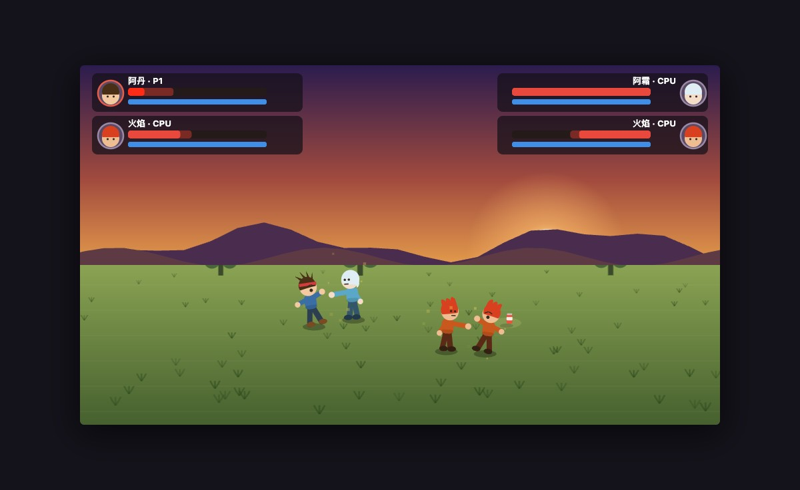
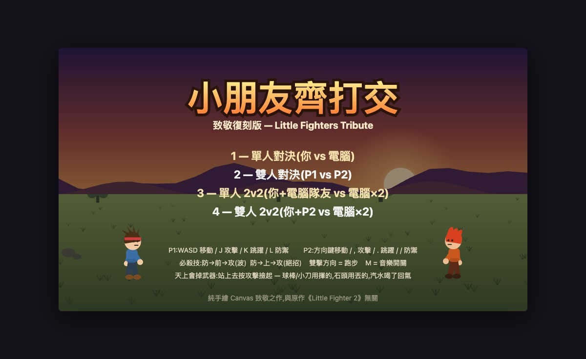
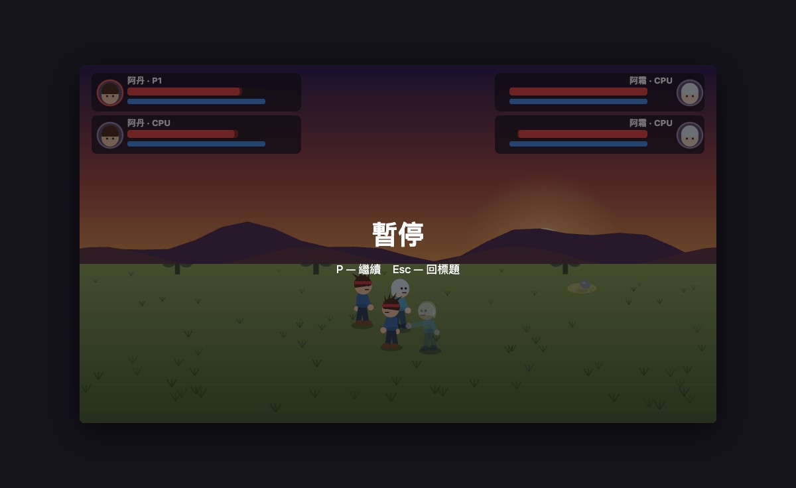

# Day 4 — 小朋友齊打交・致敬復刻版 Little Fighters Tribute

> 日期:2026-06-11　·　花費時間:約 4 小時(本體 2.5 + 加料 1.5)　·　線上 demo:純本機 `open index.html`

## 一、這天做了什麼

復刻童年經典《小朋友齊打交》(Little Fighter 2)的核心玩法:2.5D 縱深格鬥、雙擊跑步、三連擊、防禦、搓招放波,加上 LF2 三寶——**撿武器**(球棒/小刀/石頭/汽水從天而降)、**2v2 群架**(共 4 種模式)、**場景捲軸**(兩個螢幕寬的戰場 + 三層視差)。4 隻原創致敬角色,全部 Canvas 向量手繪、WebAudio 即時合成音效和戰鬥 BGM,零依賴零素材,macOS 瀏覽器直接開 `index.html` 就能玩。

## 二、為什麼做這個

LF2 是台灣香港一代人的回憶,當年資訊課偷玩的就是它。它的手感有幾個很特別的設計——縱深沒對齊就打不到人、「防→前→攻」的搓招輸入、被打倒地的無敵時間、撿起武器整個人變強的爽感——這些機制看起來簡單,自己動手做一次才知道每一條都是學問。延續 Day 1 夢遊先生的「致敬但不抄素材」路線:玩法復刻、美術音效全原創,版權乾淨(原作音效檔有版權,所以連音效都用 WebAudio 從波形合成)。

## 三、怎麼想的(思考過程 & 技術選擇)

- **引擎和畫面徹底分離**:`engine.js` 純邏輯零 DOM(座標、狀態機、命中判定、武器、粒子都是純資料),`render.js` 只負責畫。好處是引擎可以直接丟進 Node 跑模擬測試,讓 AI 互打幾千幀自動驗證,不用人肉打 16 種角色組合。
- **座標系是 2.5D 的關鍵**:x 是水平(世界寬 1920,比螢幕寬一倍)、z 是縱深(同時是畫面 y 位置)、y 是離地高度,畫面位置 = `(x - camX, z - y)`。攻擊命中要求 |Δz| < 22,這一條就是 LF2「站歪了打不到」的精髓。
- **搓招用輸入歷史佇列**:每個按鍵事件記下(鍵, 幀號),按攻擊時往回掃 48 幀內有沒有「防 → 方向」的序列。天然支援「按住防禦搓」和「點放防禦搓」兩種手感。
- **組隊用 team 欄位而不是寫死 1v1**:加料時把引擎從「兩個固定對手」改成「名單制」(`specs` 陣列,每人帶 team / isAI),命中判定一律問 `enemiesOf(f)`。1v1 只是 2v2 的特例,四種模式共用同一套程式。
- **武器全部資料驅動**:球棒小刀是「揮的」(耐久、範圍、擊倒參數),石頭是「丟的」(平飛彈道),汽水是「喝的」(回 MP)。被擊倒會掉武器、丟出去的武器落地能再撿,都跟 LF2 一樣。
- **捲軸用三層視差**:天空不動、遠山 0.35 倍速、地面 1:1,各自畫一次進 offscreen canvas 快取,每幀只是三次 drawImage。
- **BGM 也是合成的**:132 BPM 的 A 小調 riff(大鼓/小鼓/hi-hat/貝斯),用 WebAudio 排程器每 40ms 往前排 0.18 秒的音,M 鍵開關。
- **放棄的東西**:原作的場景物件破壞、變身角色、8 人混戰都沒做,先把 1v1 到 2v2 的手感做對。

## 四、踩了哪些坑、怎麼解的(本日精華)

| 遇到的問題 | 卡在哪 | 怎麼解決 | 學到什麼 |
|---|---|---|---|
| AI 互打 1200 幀只打中 3 下 | 兩隻 AI 站在 64px 距離瘋狂揮空:AI 出手距離(70)比拳頭實際範圍(54)遠,接近邏輯又在 60 就停 | 寫了 `test/probe.js` 統計狀態分布才看出來;把出手距離對齊拳頭範圍 | 調 AI 別用猜的,先量化「它到底在幹嘛」;範圍類參數要從同一個來源讀 |
| 空中被打會永遠飄在半空 | 非擊倒攻擊把空中的人打進 `hurt`,`hurt` 結束直接回 `idle`——兩個狀態都沒重力 | 規則改成「空中吃招一律擊落」(LF2 本來也是這樣) | 狀態機要逐狀態問「這個狀態管不管重力?」 |
| 搓招偶爾無效,查了很久 | 「放開防禦 + 按攻擊」落在同一幀時,防禦分支先把狀態切回 idle 就 `return`,攻擊鍵被吃掉 | 防禦狀態裡把攻擊判定移到「是否放開防禦」之前;補回歸測試 | 同一幀多個輸入的處理順序是格鬥遊戲手感的隱形殺手 |
| 瀏覽器驗證一直「按了沒反應」 | 以為是輸入 bug,debug 半天發現是站樁的 P1 早被 CPU 打到 KO,遊戲結束後輸入本來就凍結 | 改用 2P 模式做受控驗證(沒有 AI 干擾) | 自動化測試遊戲時環境要先「靜止」,會動的 AI 是測試噪音源 |
| 石頭丟 220px 外的人丟不到 | 丟出去的武器沿用了角色的重力參數,拋物線太陡,174px 就落地;但 AI 的丟石判斷寫著 430px | 丟出武器改平飛彈道(重力 0.14),AI 射程同步對齊;測試把「有沒有掉血」獨立成一條 assert 才抓到 | 彈道射程要回頭跟「使用它的 AI」對齊,不然 AI 看起來會做白工;assert 寫太寬鬆會讓 bug 裝死 |
| Node vm 載入瀏覽器全域腳本 | `vm.runInContext` 裡的 `const` 不掛在 context 物件上,外面拿不到 | 用 `vm.runInContext('CHAR_KEYS', ctx)` 把參照「念」出來 | vm 的全域 lexical scope 跟 context 物件是兩回事 |

## 五、成果怎麼看

- 怎麼跑:`open index.html`(macOS 任何瀏覽器,雙擊也行)
- 四種模式:`1` 單人對決、`2` 雙人對決、`3` 單人 2v2(你+電腦隊友)、`4` 雙人 2v2(你+P2 合作)
- P1:`WASD` 移動、`J` 攻擊、`K` 跳、`L` 防禦;P2:方向鍵移動、`,` 攻擊、`.` 跳、`/` 防禦
- 搓招:`防→前→攻` 放波(每隻角色不一樣)、`防→上→攻` 放絕招;雙擊方向跑步;`M` 音樂開關
- 武器:天上會掉,站上去按攻擊撿——球棒/小刀用揮的(有耐久),石頭用丟的,汽水喝了回氣;被擊倒會掉武器
- 引擎測試:`node test/sim.js`(16 種組合互打 + 2v2 群架 + 武器系統 + 回歸案例);AI 行為探針:`node test/probe.js dan blaze [--2v2]`

| 標題(4 模式) | 2v2 群架 | 對波瞬間 |
|---|---|---|
|  |  |  |

## 六、下次會怎麼做(給未來的自己)

- 角色動作的「pose 參數表」一開始就該畫在紙上,邊寫邊想花了不少時間。
- AI 的手感調參應該更早引入探針工具,第一版 AI 就該帶統計輸出。
- 命中範圍、彈道射程之類的數字,引擎和 AI 要共用同一張表(這次 AI 自己抄了一份,出了兩次同型 bug:拳頭範圍一次、石頭射程一次)。
- 一開始就用「名單制」設計引擎的話,2v2 就不用回頭改建構式了——多人對戰類遊戲別從 1v1 寫死起手。

## 七、一句話總結

最爽的瞬間:看著電腦隊友自己跑去撿了把小刀回來幫我砍人——格鬥遊戲的「手感」原來是幾十個小數字疊出來的,而「生態感」是幾條簡單規則湊出來的。
