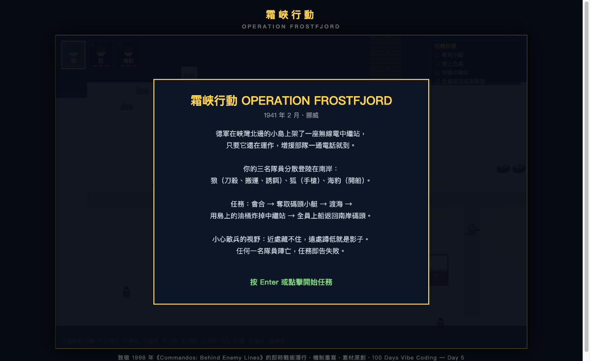
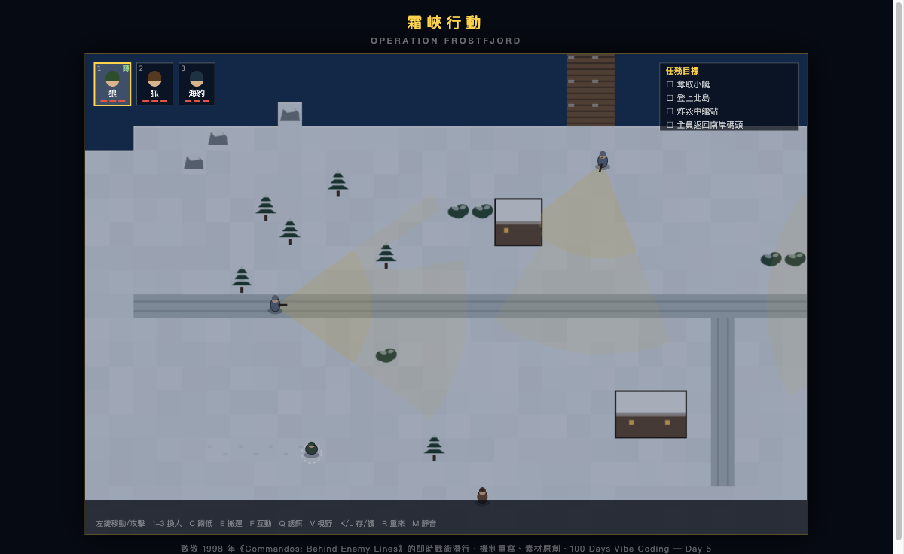

# Day 5 — 霜峽行動 Operation Frostfjord

> 日期：2026-06-12　·　花費時間：約 {X} 小時　·　純本機 `open index.html`

## 一、這天做了什麼

致敬 1998 年《Commandos: Behind Enemy Lines》第一關的**即時戰術潛行遊戲**：三名突擊隊員（狼／狐／海豹）分散登陸挪威雪岸，會合 → 奪小艇 → 渡海 → 用油桶炸掉小島上的無線電中繼站 → 全員撤離。視野錐雙區、背後刀殺、搬屍體、誘餌、快速存讀檔，全部到位。

## 二、為什麼做這個

小時候玩的 Commandos（綠扁帽！）。順便搞清楚一個問題：為什麼有人能做出網頁版紅色警戒（[Chrono Divide](https://game.chronodivide.com/)）公開給大家玩而不被告？

研究結論（本日重要收穫）：
- **遊戲機制不受著作權保護**，受保護的是「表達」——程式碼、美術、音效、地圖、角色。
- Chrono Divide 守住兩條線：①引擎 clean-room 從零重寫；②**一個原版素材都不附**，
  那個「Locate original game assets」匯入畫面就是整個法律防線，玩家素材自備。
- Commandos 商標在 Kalypso Media 手上而且 IP 是活的（2025 年 4 月才出新作 Origins），
  比 EA 那種放著的老 IP 更要小心 → 本作沿用 Day 4 路線：**抄機制、不抄素材**，
  名稱角色美術音效全原創，連素材匯入那招都不需要。

## 三、怎麼想的（思考過程 & 技術選擇）

- 先寫 `DEVELOPMENT.md` 開發說明（版權研究 + 原作第一關考據 + 規格 + M1~M6 里程碑），再逐一開發。
- 沿用 Day 1 / Day 4 驗證過的架構：**engine.js 純邏輯零 DOM**（Node 直接測）+ render.js 全 Canvas 向量手繪 + WebAudio 合成音效，零依賴零建置。
- 地圖用 **ASCII 字元畫**（50×34 格），好讀好改，之後加關卡＝加資料。
- 視野錐做了原作的靈魂機制「**雙區**」：近區（顏色深）蹲了也沒用、遠區蹲低緩行隱形。
- 敵兵三態 FSM：巡邏 →（目擊值累積／聽到聲音）→ 起疑「?」→ 警戒「!」追擊開槍。
- 測試策略：82 條 Node 回歸（視野規則矩陣、FSM、刀殺判定）＋一條「**後勤通關腳本**」——
  把全部指令從頭餵到尾斷言 WIN，保證關卡幾何永遠可解。

## 四、踩了哪些坑、怎麼解的（本日精華）

| 遇到的問題 | 卡在哪 | 怎麼解決 | 學到什麼 |
|---|---|---|---|
| 開場 3 秒狐就被打死 | 出生點正好在村莊巡邏兵西側路線的視野錐裡，站著不動也會被盯上 | 移出生點＋加一條「開場 30 秒全員不動必須安全」的回歸測試 | Day 4 教訓重演：AI 相關的位置/參數不要用猜的，寫個 sim 跑一遍最快 |
| 背後刀殺永遠殺不到 | A* 只走到「格子中心」，背後接近點離哨兵 32px，刀殺判定 30px——差 2px 永遠搆不著 | 刀殺範圍放寬到 38px＋最後一步改直線突進（不受格點限制） | 格點尋路＋連續判定混用時，邊界要留 buffer，別讓兩套座標系統打架 |
| 敵兵互相呼喊沒人聽見 | 噪音事件用 fresh 旗標管生命週期，呼喊在「處理噪音的同一幀」被 push，幀尾直接被標成已處理 | 改成「快照＋清空」雙佇列：本幀取走舊的處理，新產生的留給下一幀 | 事件佇列「邊處理邊生產」時，旗標式生命週期很容易自己吃掉自己 |
| Playwright 連到別的網站 | 臨時 server 開 8765，畫面卻是「CSI 機台管理」——port 被佔了 | 換 port | 開 dev server 先想想自己機器上還跑著什麼 |

## 五、成果怎麼看

- 直接 `open index.html`（零依賴，雙擊也行）
- 回歸測試：`node test/sim.js`（85 條全過）
- 操作：左鍵移動/攻擊、1-3 換人、C 蹲低、E 搬運、F 互動、Q 誘餌、V 視野錐開關、K/L 快速存讀檔（致敬原作 Ctrl+S）、R 重來
- 攻略提示:狼繞背後用刀、屍體拖進灌木、誘餌把碼頭哨兵騙離崗位、過巡邏線記得蹲

## 六、下次會怎麼做（給未來的自己）

- 出生點安全測試應該第一天就寫，而不是被玩家死法逼出來。
- 視野錐＋FSM 的參數（張角/距離/累積速率）值得做成 debug 面板現場調，猜數字來回改檔太慢。
- 未做清單：雪地腳印被 AI 跟蹤（原作第一關 gallery 裡士兵真的會跟腳印！）、機槍堡奪取、第二關之後、行動版操作。

## 七、一句話總結

搞懂了「致敬遊戲的法律安全線」這門課，然後把小時候的綠扁帽（現在叫狼）放回雪地裡摸哨。

---

*致敬 Pyro Studios《Commandos: Behind Enemy Lines》(1998)。機制重寫、名稱角色美術音效全原創，不含任何原作素材。Inspired by, not affiliated with, the Commandos franchise (trademark of Kalypso Media Group GmbH).*
