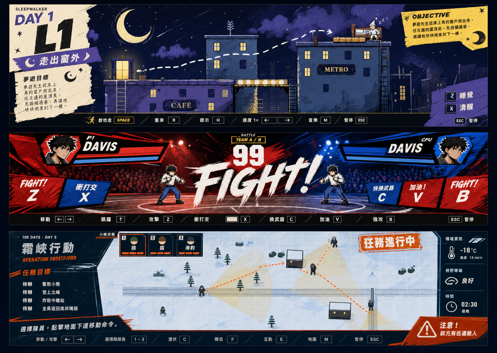

# 三款遊戲 UI 全重畫設計規格

日期：2026-07-18
狀態：待 Kevin 審閱
選定方向：Graphic Arcade（第二張視覺稿）

## 1. 目標

把 Day 1、Day 4、Day 5 從「原介面換配色」升級成一眼可辨識的完整 UI 重畫：

- 標題、選擇、遊戲中 HUD、提示、暫停與結算都有新的版型。
- 三款共用操作邏輯，玩家不用重新學習資訊位置。
- 三款各自有獨立美術身份，不像同一組元件換顏色。
- 遊戲區仍是最大視覺主角，不加入固定系列側欄。
- 不修改關卡、角色能力、敵人 AI、碰撞或通關條件。

## 2. 共用設計骨架

### 全畫面流程

- 標題與選擇畫面使用滿版主視覺，不再是置中的小卡片。
- 主標、模式或關卡編號佔據第一視覺層。
- 主要操作只有一個高強度 CTA；次要操作降階處理。
- 暫停、勝負與任務結算使用專屬畫面，不沿用一般訊息卡。

### 遊戲中 HUD

- 遊戲內容維持最大面積。
- 上方只放即時狀態：關卡／計時／隊伍／目標。
- 下方放情境操作列：只顯示當下真的可用的按鍵。
- 關鍵事件使用大字、切角色塊與短暫動態，不長期遮住玩法。
- `ESC`、`Z`、`X`、方向鍵等快捷鍵使用一致的鍵帽樣式。

### 視覺語言

- 共同元素：粗體標題、硬切角、網點印刷紋理、斜向動勢、黑色資訊底。
- 不使用玻璃擬態、柔軟圓角 SaaS 卡片、卡片套卡片或細小低對比文字。
- 每款最多兩套字型；優先使用系統字型與現有載入方式，避免新增網路依賴。
- HUD 必須在 1280×720 與 844×390 橫向畫面保持可讀。

## 3. Day 1 — Sleepwalker

### 美術身份

夢境漫畫／夜間繪本：深藍、紫色、紙張米白、酸黃色。使用撕紙邊、粉筆路線與超大月亮／關卡數字。

### 畫面

- 標題：滿版夜景，`DAY 1` 與主角成為視覺焦點，開始按鈕像漫畫章節標籤。
- 關卡選擇：十個關卡改為橫向章節票券；鎖定、已完成與目前關卡狀態明確。
- 遊戲 HUD：左側大關卡章節、右側目標紙條、底部黑色操作軌。
- 道具選擇：用高對比漫畫貼紙呈現，不再使用一般按鈕列。
- 勝負：成功是「夢境通過」章節跨頁；失敗是警醒式斷頁。

## 4. Day 4 — Little Fighter

### 美術身份

熱血格鬥海報／現場轉播：紅、鈷藍、黑、骨白。使用爆裂筆刷、網點人群、斜向選手名牌與巨大倒數。

### 畫面

- 標題：角色剪影與賽事海報構圖；模式選擇是主賽／團體賽大型票券。
- 選角：角色不再被平均塞進小卡片；目前選手放大，招式與隊伍資訊側列。
- 戰鬥 HUD：左右角落選手名牌、中央巨大計時器、加粗血量／氣量。
- 操作提示：改為場邊 LED／轉播字幕，只在回合開始或情境變化時強調。
- 暫停與 KO：滿版賽事中斷／結果海報，不使用半透明通用面板。

## 5. Day 5 — Frostfjord

### 美術身份

極地任務刊物／戰術海報：冰藍、海軍藍、安全橘、白色。使用粗網格、任務戳記、方向箭頭與警告切角。

### 畫面

- 簡報：任務名稱、隊員、四個目標與主要行動形成一頁作戰刊物。
- 遊戲 HUD：左側窄版任務摘要、上方隊員條、右側環境／威脅資訊、底部命令軌。
- 警戒：視野、可疑、發現與引信倒數使用橘紅色大標，不只改小字顏色。
- 隊員選擇：三人狀態以可快速掃讀的色條與角色輪廓表示。
- 結算：成功使用完成戳記與撤離摘要；失敗顯示原因與立即重試。

## 6. 技術邊界

- Day 1：保留 Canvas 場景與拖放邏輯；主要重構 HTML overlay、CSS 與 HUD DOM。
- Day 4：保留引擎與角色資料；重寫 `render.js` 的 title、select、HUD、pause、KO 繪製。
- Day 5：保留地圖、AI 與任務狀態；重寫 `render.js` 的 briefing、squad、mission、alert、over UI。
- 不引入框架、外部 CDN、遠端字型或新的執行依賴。
- 所有畫面仍可直接開啟各 Day 的 `index.html` 執行。

## 7. 狀態與資料流

- 現有遊戲狀態仍是唯一資料來源。
- UI 只讀取既有 level、fighter、team、mission、alert 與 pause 狀態。
- 新畫面不另建第二份狀態，避免顯示內容與遊戲引擎不同步。
- 視窗縮放只改畫面比例，不改 Canvas 邏輯座標與輸入判定。

## 8. 失敗保護

- 缺少字型時使用明確 fallback，不造成文字溢出。
- 小高度螢幕隱藏次要說明，保留主要狀態與操作鍵。
- 長關卡名／角色名需裁切或縮排，不覆蓋血量與目標。
- 暫停與結算畫面必須阻止底層誤操作。

## 9. 驗收標準

- 把新版與 commit `db29870` 並排時，三款都能在一秒內看出是重新設計。
- 標題、選擇、遊戲、暫停、成功／失敗等主要狀態都有專屬畫面。
- 1280×720 與 844×390 無裁切、重疊或不可讀快捷鍵。
- 遊戲區沒有被固定側欄壓縮。
- Day 1 `solve.js`、`robust.js`，Day 4 `sim.js`，Day 5 `sim.js` 全部通過。
- 瀏覽器 Console 無 error，核心操作可實際完成。
- 最終 QA 必須把選定視覺稿與三款實作截圖放在同一張比較圖檢查。

## 10. 不在本次範圍

- 重畫角色 sprites、敵人、建築或地圖。
- 修改玩法、數值平衡、關卡結構或新增角色。
- 新增系列首頁、固定收藏側欄、登入、排行榜或雲端存檔。
- 本輪在 Kevin 確認預覽前不 push 到 GitHub。
